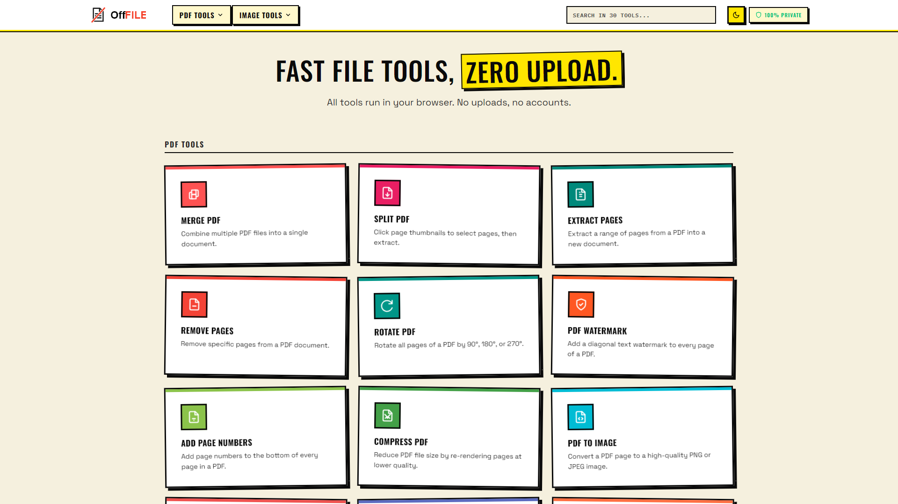
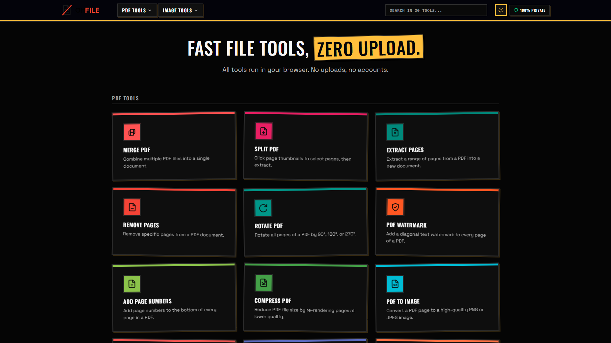
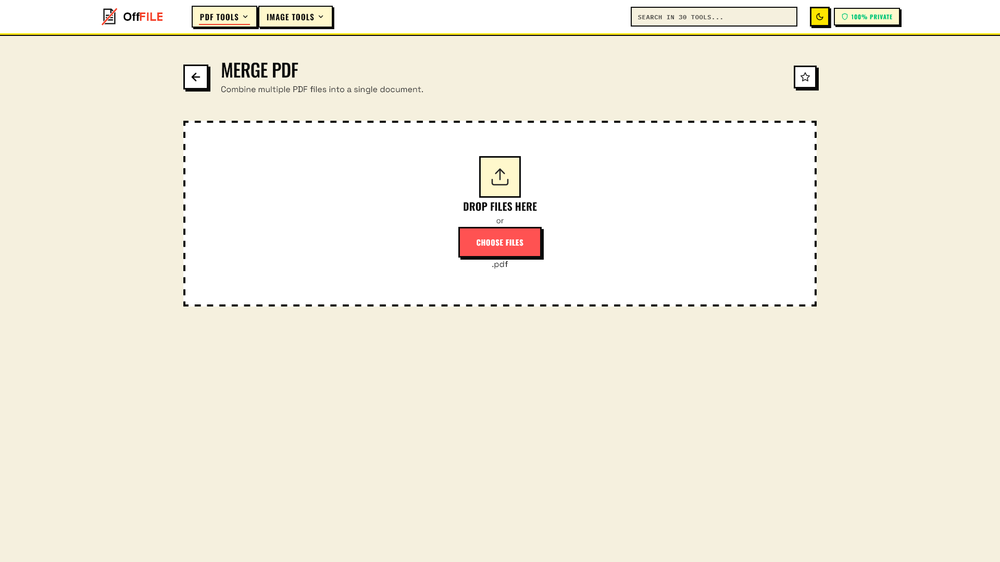

# OffFile

[](LICENSE)
[](package.json)
[](https://offfile.sametsarikaya.com)

30 file tools that run entirely in your browser. No uploads, no accounts, no server.

**[offfile.sametsarikaya.com](https://offfile.sametsarikaya.com)** - no install required.

---





---

## Why

Most online file tools send your files to a server. They have to - that's where the processing happens. OffFile does everything locally using Web Workers and browser APIs, so your files never leave your device. It works offline once loaded.

## Tools

**PDF (14)** - Merge, Split, Compress, Rotate, Watermark, Add Page Numbers, Reorder Pages, Extract Pages, Remove Pages, PDF to Image, PDF to Text, PDF Metadata, Resize Pages, Add Blank Page

**Image (16)** - Convert, Compress, Resize, Rotate, Flip, Crop, Watermark, Filters, Grayscale, Add Background, Merge/Stack, Strip Metadata, Image to PDF, Image to Base64, Color Palette, Collage

## Stack

- TypeScript + Vite
- pdf-lib and pdfjs-dist for PDF
- Canvas API for image processing
- Web Workers for off-main-thread processing

No frameworks. No backend.

## Running locally

```sh
npm install
npm run dev
```

Build:

```sh
npm run build
```

## Privacy

All processing runs in the browser. No data is sent anywhere. No analytics, no cookies, no accounts.

## License

GNU Affero General Public License v3.0 (AGPLv3) - see [LICENSE](LICENSE).
